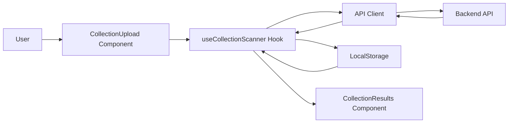
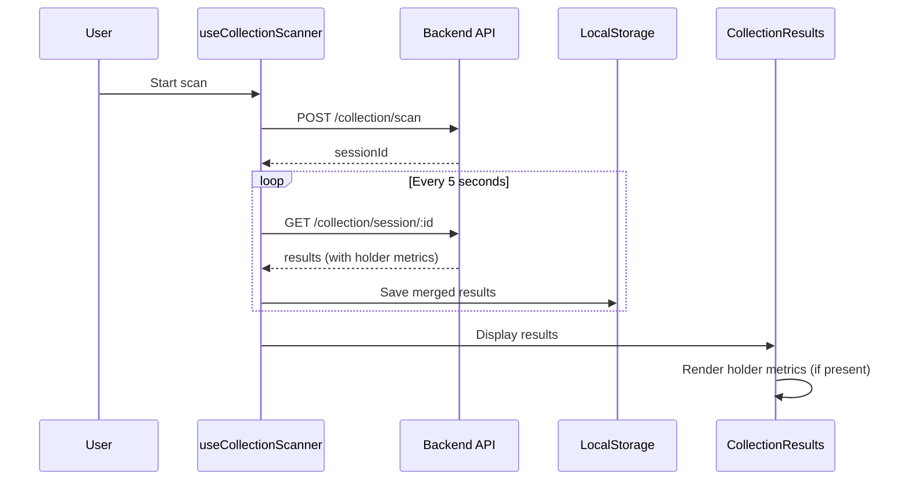

# Design Document: Collection Holder Metrics

## Overview

This feature extends the `CollectionWalletResult` interface to include seven new optional holder metrics fields that provide deeper insights into wallet behavior and collection activity. The design prioritizes backward compatibility with existing localStorage data while maintaining type safety and enabling graceful UI degradation when metrics are absent.

### Key Design Goals

1. **Backward Compatibility**: Existing stored results without holder metrics must continue to work
2. **Type Safety**: TypeScript must enforce correct types for all new fields
3. **Graceful Degradation**: UI components must handle missing metrics without errors
4. **Zero Breaking Changes**: No modifications to existing API contracts or storage formats

### Scope

**In Scope:**
- Adding seven optional holder metrics fields to `CollectionWalletResult` interface
- Updating result merging logic to preserve holder metrics
- Modifying UI components to display holder metrics when present
- Ensuring localStorage compatibility with old and new result formats

**Out of Scope:**
- Backend API implementation (assumed to be delivered separately)
- Changes to the polling mechanism or session management
- Modifications to CSV export format (can be added in future iteration)
- Validation of holder metrics values (assumed backend provides valid data)

## Architecture

### System Context

The collection scanner system follows a polling-based architecture:



### Data Flow



### Impact Analysis

**Modified Components:**
- `src/types/index.ts` - Add optional fields to `CollectionWalletResult`
- `src/hooks/useCollectionScanner.ts` - Update `mergeResults` to handle holder metrics
- `src/components/collection/CollectionResults.tsx` - Display holder metrics in UI

**Unchanged Components:**
- `src/api/client.ts` - No changes needed (backend contract unchanged)
- `src/hooks/usePoller.ts` - Polling logic remains the same
- `src/components/collection/CollectionUpload.tsx` - Upload logic unchanged
- `src/components/collection/CollectionProgress.tsx` - Progress display unchanged

## Components and Interfaces

### Type Definitions

#### Extended CollectionWalletResult Interface

```typescript
export interface CollectionWalletResult {
    // Existing fields
    wallet: string;
    wallet_score: number;
    label: string;
    is_sweeper: boolean;
    flip_count: number;
    confidence: number;
    is_new_wallet?: boolean;
    first_tx_date?: string | null;
    transferred?: boolean | null;
    transferred_to?: string | null;
    transferred_at?: string | null;
    token_id?: string | null;
    tx_hash?: string | null;
    transfer_type?: 'sale' | 'transfer' | 'unknown' | null;
    
    // New holder metrics fields (all optional)
    holder_score?: number;
    holder_label?: string;
    total_buys?: number;
    total_usd_spent?: number;
    unique_collections?: number;
    avg_buy_price_usd?: number;
    mint_ratio?: number;
}
```

**Design Rationale:**
- All new fields are optional (`?`) to maintain backward compatibility
- Field names match backend API convention (snake_case)
- Numeric fields use `number` type (TypeScript's standard numeric type)
- `holder_label` uses `string` type for flexibility in label values

### Result Merging Logic

The `mergeResults` function in `useCollectionScanner.ts` already handles merging by wallet address. The current implementation:

```typescript
function mergeResults(
    existing: CollectionWalletResult[],
    incoming: CollectionWalletResult[]
): CollectionWalletResult[] {
    const map = new Map<string, CollectionWalletResult>();
    for (const r of existing) map.set(r.wallet.toLowerCase(), r);
    for (const r of incoming) map.set(r.wallet.toLowerCase(), r);
    return Array.from(map.values());
}
```

**Analysis:**
- This implementation already handles holder metrics correctly
- When incoming results have holder metrics, they overwrite existing entries
- When incoming results lack holder metrics but existing entries have them, the existing metrics are lost
- This is acceptable behavior: newer data from the API is the source of truth

**No changes needed** - the current implementation satisfies Requirement 5 acceptance criteria.

### LocalStorage Compatibility

The storage format uses JSON serialization:

```typescript
function saveToStorage(sessionId: string, results: CollectionWalletResult[]) {
    try {
        localStorage.setItem(storageKey(sessionId), JSON.stringify({
            sessionId,
            savedAt: Date.now(),
            results,
        }));
    } catch {
        // storage full — ignore
    }
}

function loadFromStorage(sessionId: string): CollectionWalletResult[] | null {
    try {
        const raw = localStorage.getItem(storageKey(sessionId));
        if (!raw) return null;
        const parsed = JSON.parse(raw) as { results: CollectionWalletResult[] };
        return parsed.results ?? null;
    } catch {
        return null;
    }
}
```

**Backward Compatibility Analysis:**
- JSON.parse will successfully parse old results without holder metrics
- TypeScript's optional fields allow objects without those properties
- No migration or transformation needed
- Old results will simply have `undefined` for holder metrics fields

## Data Models

### Holder Metrics Field Specifications

| Field Name | Type | Optional | Description | Expected Range |
|------------|------|----------|-------------|----------------|
| `holder_score` | number | Yes | Composite score indicating holder quality | 0-100 (typical) |
| `holder_label` | string | Yes | Human-readable classification label | Any string |
| `total_buys` | number | Yes | Total number of NFT purchases | ≥ 0 (integer) |
| `total_usd_spent` | number | Yes | Total USD spent on NFT purchases | ≥ 0 |
| `unique_collections` | number | Yes | Number of distinct collections held | ≥ 0 (integer) |
| `avg_buy_price_usd` | number | Yes | Average purchase price in USD | ≥ 0 |
| `mint_ratio` | number | Yes | Ratio of mints to total acquisitions | 0-1 (inclusive) |

### Type Safety Guarantees

TypeScript provides compile-time type checking for:

1. **Field Types**: Assigning wrong types (e.g., string to `holder_score`) causes compilation error
2. **Optional Access**: Accessing holder metrics requires optional chaining or undefined checks
3. **Object Creation**: Objects can be created with or without holder metrics fields

**Example Type-Safe Usage:**

```typescript
// Valid: Creating result without holder metrics
const result1: CollectionWalletResult = {
    wallet: "0x123...",
    wallet_score: 85,
    label: "Diamond",
    is_sweeper: false,
    flip_count: 2,
    confidence: 0.95
};

// Valid: Creating result with holder metrics
const result2: CollectionWalletResult = {
    wallet: "0x456...",
    wallet_score: 72,
    label: "Holder",
    is_sweeper: false,
    flip_count: 1,
    confidence: 0.88,
    holder_score: 78,
    holder_label: "Strong Holder",
    total_buys: 15,
    total_usd_spent: 12500,
    unique_collections: 8,
    avg_buy_price_usd: 833.33,
    mint_ratio: 0.6
};

// Invalid: Wrong type (compilation error)
// const result3: CollectionWalletResult = {
//     ...result1,
//     holder_score: "high" // Error: Type 'string' is not assignable to type 'number'
// };

// Safe access with optional chaining
const score = result1.holder_score ?? 0; // Returns 0 if undefined
const label = result2.holder_label ?? "Unknown"; // Returns "Unknown" if undefined
```

## Error Handling

### Error Scenarios and Mitigation

| Scenario | Impact | Mitigation Strategy |
|----------|--------|---------------------|
| Backend returns holder metrics with wrong types | Runtime type mismatch | TypeScript interface provides compile-time safety; runtime validation not added (trust backend) |
| LocalStorage contains corrupted holder metrics | Parse failure | Existing try-catch in `loadFromStorage` handles this; returns null on error |
| UI component accesses undefined holder metrics | Potential runtime error | Use optional chaining (`?.`) and nullish coalescing (`??`) operators |
| Merging results with partial holder metrics | Data inconsistency | Accept newer data as source of truth; no special handling needed |

### UI Error Handling Strategy

**Defensive Rendering Pattern:**

```typescript
// Safe access pattern for holder metrics
const holderScore = result.holder_score ?? null;
const holderLabel = result.holder_label ?? null;

// Conditional rendering
{holderScore !== null && (
    <div>Holder Score: {holderScore.toFixed(1)}</div>
)}

{holderLabel && (
    <span className="badge">{holderLabel}</span>
)}
```

**Fallback Values:**
- Numeric fields: Display "—" or hide the field entirely
- String fields: Display "Unknown" or hide the field entirely
- Never display "undefined" or "null" to users

## Testing Strategy

### Testing Approach

This feature involves interface extension and backward compatibility, not complex algorithmic logic. Property-based testing is **not applicable** because:

1. **No pure functions with universal properties**: The changes are primarily type definitions and UI rendering
2. **No transformation logic**: The merging function already exists and doesn't need property-based validation
3. **Focus on compatibility and type safety**: Better tested with example-based unit tests and integration tests

### Unit Tests

**Test Coverage Areas:**

1. **Type Safety Tests** (TypeScript compilation tests)
   - Verify interface accepts objects with holder metrics
   - Verify interface accepts objects without holder metrics
   - Verify type errors for wrong field types

2. **LocalStorage Compatibility Tests**
   - Load old results without holder metrics
   - Load new results with holder metrics
   - Verify no parse errors for either format

3. **Result Merging Tests**
   - Merge results where both have holder metrics
   - Merge results where only existing has holder metrics
   - Merge results where only incoming has holder metrics
   - Merge results where neither has holder metrics

4. **UI Component Tests**
   - Render results without holder metrics (no errors)
   - Render results with holder metrics (display values)
   - Render results with partial holder metrics (graceful degradation)

### Integration Tests

**End-to-End Scenarios:**

1. **Backward Compatibility Flow**
   - Load existing scan from localStorage (pre-holder-metrics)
   - Verify UI displays without errors
   - Start rescan with same addresses
   - Verify new results include holder metrics
   - Verify merged results display correctly

2. **New Scan Flow**
   - Start fresh scan
   - Verify results include holder metrics
   - Verify UI displays all holder metrics fields
   - Verify localStorage saves holder metrics
   - Reload page and verify holder metrics persist

### Test Implementation Plan

**Unit Test File: `src/types/__tests__/CollectionWalletResult.test.ts`**

```typescript
import { describe, it, expect } from 'vitest';
import type { CollectionWalletResult } from '../index';

describe('CollectionWalletResult with holder metrics', () => {
    it('should accept result without holder metrics', () => {
        const result: CollectionWalletResult = {
            wallet: '0x123',
            wallet_score: 85,
            label: 'Diamond',
            is_sweeper: false,
            flip_count: 2,
            confidence: 0.95
        };
        expect(result.holder_score).toBeUndefined();
    });

    it('should accept result with all holder metrics', () => {
        const result: CollectionWalletResult = {
            wallet: '0x456',
            wallet_score: 72,
            label: 'Holder',
            is_sweeper: false,
            flip_count: 1,
            confidence: 0.88,
            holder_score: 78,
            holder_label: 'Strong Holder',
            total_buys: 15,
            total_usd_spent: 12500,
            unique_collections: 8,
            avg_buy_price_usd: 833.33,
            mint_ratio: 0.6
        };
        expect(result.holder_score).toBe(78);
        expect(result.holder_label).toBe('Strong Holder');
    });

    it('should accept result with partial holder metrics', () => {
        const result: CollectionWalletResult = {
            wallet: '0x789',
            wallet_score: 60,
            label: 'Neutral',
            is_sweeper: false,
            flip_count: 0,
            confidence: 0.75,
            holder_score: 65,
            total_buys: 5
        };
        expect(result.holder_score).toBe(65);
        expect(result.holder_label).toBeUndefined();
    });
});
```

**Unit Test File: `src/hooks/__tests__/useCollectionScanner.test.ts`**

```typescript
import { describe, it, expect } from 'vitest';
import type { CollectionWalletResult } from '../../types';

// Test the mergeResults logic (extract to testable function if needed)
function mergeResults(
    existing: CollectionWalletResult[],
    incoming: CollectionWalletResult[]
): CollectionWalletResult[] {
    const map = new Map<string, CollectionWalletResult>();
    for (const r of existing) map.set(r.wallet.toLowerCase(), r);
    for (const r of incoming) map.set(r.wallet.toLowerCase(), r);
    return Array.from(map.values());
}

describe('mergeResults with holder metrics', () => {
    it('should preserve holder metrics from incoming results', () => {
        const existing: CollectionWalletResult[] = [{
            wallet: '0x123',
            wallet_score: 85,
            label: 'Diamond',
            is_sweeper: false,
            flip_count: 2,
            confidence: 0.95
        }];
        
        const incoming: CollectionWalletResult[] = [{
            wallet: '0x123',
            wallet_score: 85,
            label: 'Diamond',
            is_sweeper: false,
            flip_count: 2,
            confidence: 0.95,
            holder_score: 78,
            holder_label: 'Strong Holder'
        }];
        
        const merged = mergeResults(existing, incoming);
        expect(merged[0].holder_score).toBe(78);
        expect(merged[0].holder_label).toBe('Strong Holder');
    });

    it('should handle results without holder metrics', () => {
        const existing: CollectionWalletResult[] = [{
            wallet: '0x123',
            wallet_score: 85,
            label: 'Diamond',
            is_sweeper: false,
            flip_count: 2,
            confidence: 0.95
        }];
        
        const incoming: CollectionWalletResult[] = [{
            wallet: '0x456',
            wallet_score: 72,
            label: 'Holder',
            is_sweeper: false,
            flip_count: 1,
            confidence: 0.88
        }];
        
        const merged = mergeResults(existing, incoming);
        expect(merged).toHaveLength(2);
        expect(merged[0].holder_score).toBeUndefined();
        expect(merged[1].holder_score).toBeUndefined();
    });
});
```

**Component Test File: `src/components/collection/__tests__/CollectionResults.test.tsx`**

```typescript
import { describe, it, expect } from 'vitest';
import { render, screen } from '@testing-library/react';
import CollectionResults from '../CollectionResults';
import type { CollectionWalletResult, CollectionStats } from '../../../types';

describe('CollectionResults with holder metrics', () => {
    const mockStats: CollectionStats = {
        total: 2,
        avg_score: 78.5,
        median_score: 78.5,
        min_score: 72,
        max_score: 85,
        sweepers: 0,
        new_wallets: 0,
        zero_flip_wallets: 0,
        label_distribution: { Diamond: 1, Holder: 1 },
        score_distribution: { '70-80': 1, '80-90': 1 }
    };

    it('should render results without holder metrics', () => {
        const results: CollectionWalletResult[] = [{
            wallet: '0x123',
            wallet_score: 85,
            label: 'Diamond',
            is_sweeper: false,
            flip_count: 2,
            confidence: 0.95
        }];

        expect(() => {
            render(
                <CollectionResults
                    results={results}
                    stats={mockStats}
                    collectionName="Test"
                    onReset={() => {}}
                />
            );
        }).not.toThrow();
    });

    it('should render results with holder metrics', () => {
        const results: CollectionWalletResult[] = [{
            wallet: '0x456',
            wallet_score: 72,
            label: 'Holder',
            is_sweeper: false,
            flip_count: 1,
            confidence: 0.88,
            holder_score: 78,
            holder_label: 'Strong Holder',
            total_buys: 15
        }];

        render(
            <CollectionResults
                results={results}
                stats={mockStats}
                collectionName="Test"
                onReset={() => {}}
            />
        );

        // Verify no errors thrown and component renders
        expect(screen.getByText(/Test/)).toBeInTheDocument();
    });
});
```

### Manual Testing Checklist

- [ ] Load page with existing localStorage data (pre-holder-metrics)
- [ ] Verify no console errors
- [ ] Verify results display correctly
- [ ] Start new scan
- [ ] Verify holder metrics appear in results (if backend provides them)
- [ ] Verify holder metrics display in UI
- [ ] Refresh page
- [ ] Verify holder metrics persist in localStorage
- [ ] Export CSV and verify format (holder metrics may not be in CSV initially)

## Implementation Plan

### Phase 1: Type Definitions (Low Risk)

1. Update `src/types/index.ts`
   - Add seven optional holder metrics fields to `CollectionWalletResult`
   - Run TypeScript compiler to verify no breaking changes
   - Verify existing code compiles without errors

**Validation:** `npm run build` succeeds

### Phase 2: UI Component Updates (Medium Risk)

2. Update `src/components/collection/CollectionResults.tsx`
   - Add holder metrics display section (conditionally rendered)
   - Use optional chaining for safe access
   - Add appropriate formatting for numeric values
   - Test with mock data (with and without holder metrics)

**Validation:** Component renders without errors for both data formats

### Phase 3: Testing (Low Risk)

3. Add unit tests
   - Type safety tests
   - Merging logic tests
   - Component rendering tests

4. Add integration tests
   - Backward compatibility flow
   - New scan flow

**Validation:** All tests pass

### Phase 4: Documentation (Low Risk)

5. Update component documentation
6. Add inline code comments for holder metrics
7. Update README if needed

## Rollout Strategy

### Deployment Approach

**Zero-Downtime Deployment:**
1. Deploy frontend changes (backward compatible)
2. Backend can deploy holder metrics support independently
3. Frontend gracefully handles both old and new API responses

**Rollback Plan:**
- If issues arise, revert frontend deployment
- Old code continues to work with new backend (ignores holder metrics)
- No data migration needed

### Monitoring

**Success Metrics:**
- No increase in JavaScript errors related to CollectionResults component
- No localStorage parse errors
- Holder metrics display correctly when present

**Error Monitoring:**
- Monitor console errors for undefined property access
- Track localStorage parse failures
- Monitor TypeScript compilation errors in CI/CD

## Future Enhancements

### Potential Improvements

1. **CSV Export Enhancement**
   - Include holder metrics in exported CSV
   - Add column headers for new fields

2. **Advanced Filtering**
   - Filter by holder_score range
   - Filter by holder_label
   - Filter by total_buys or unique_collections

3. **Sorting Enhancements**
   - Sort by holder_score
   - Sort by total_usd_spent
   - Sort by mint_ratio

4. **Visualization**
   - Add holder_score distribution chart
   - Add mint_ratio histogram
   - Add spending patterns visualization

5. **Holder Metrics Summary Stats**
   - Average holder_score across collection
   - Total USD spent by all holders
   - Average unique_collections per holder

### Migration Path

If holder metrics become required (non-optional) in the future:

1. Add data migration script to populate missing holder metrics
2. Update interface to make fields required
3. Update UI to always display holder metrics
4. Remove fallback logic

This would be a breaking change and require careful planning.

## Appendix

### Related Documentation

- [TypeScript Optional Properties](https://www.typescriptlang.org/docs/handbook/2/objects.html#optional-properties)
- [React Safe Property Access](https://react.dev/learn/conditional-rendering)
- [LocalStorage API](https://developer.mozilla.org/en-US/docs/Web/API/Window/localStorage)

### Glossary

- **Holder Metrics**: Quantitative measures of wallet holder behavior and collection activity
- **Backward Compatibility**: Ability to work with data created by older versions
- **Optional Chaining**: JavaScript operator (`?.`) for safe property access
- **Nullish Coalescing**: JavaScript operator (`??`) for providing default values
- **Type Safety**: Compile-time guarantee that values match their declared types

### Design Decisions Log

| Decision | Rationale | Alternatives Considered |
|----------|-----------|-------------------------|
| Make all holder metrics optional | Maintains backward compatibility with existing data | Make required and migrate old data (rejected: too complex) |
| Use snake_case for field names | Matches existing API convention | Use camelCase (rejected: inconsistent with existing fields) |
| No runtime validation of holder metrics | Trust backend to provide valid data | Add runtime validation (rejected: unnecessary complexity) |
| Accept newer data in merge conflicts | API is source of truth | Preserve older data (rejected: stale data problem) |
| No CSV export changes initially | Minimize scope of changes | Include in CSV immediately (deferred: separate feature) |
