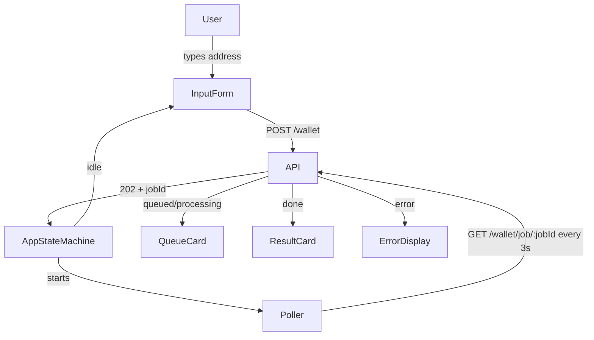
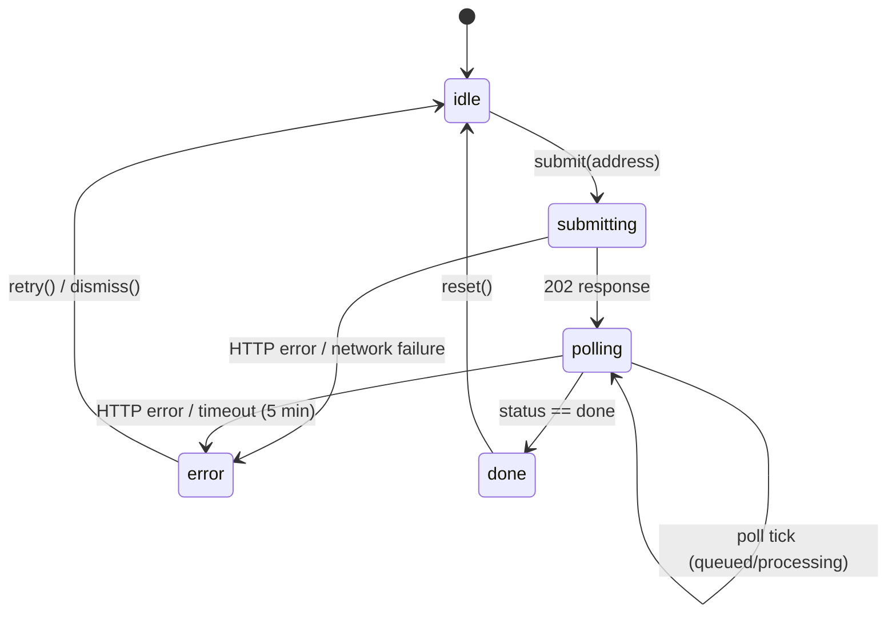

# Design Document: Jeet Checker Frontend

## Overview

The Jeet Checker Frontend is a single-page React application that lets users submit an Ethereum wallet address and receive a reputation score from the Corge backend API. The backend is async and job-based: a `POST /wallet` submission returns a `jobId`, and the frontend polls `GET /wallet/job/:jobId` every 3 seconds until the job reaches `done` status.

The UI is built on the Corge brand design system — dark charcoal canvas (`#121212`), glassmorphism cards, orange accents (`#FF5A1F`), Unbounded headings, and Space Grotesk body text. Framer Motion drives all state-transition animations.

### Key Design Decisions

- **State machine over ad-hoc flags**: A single `AppState` discriminated union drives all UI rendering, eliminating impossible states (e.g. showing a result while still polling).
- **Polling via `setInterval` + cleanup**: Simple, predictable, and easy to cancel. No external polling library needed.
- **Validation at the form layer**: Wallet address format is validated client-side before any network call, keeping the API clean.
- **Optimistic cached-result handling**: If the first poll response already has `status: "done"`, the app skips the queue display entirely.

---

## Architecture

The application is a client-side SPA with no server-side rendering. All state lives in React component state and context; there is no global state library.



### State Machine

The app has a single top-level state machine with these states:

```
idle → submitting → polling → done → idle (via reset)
                           ↘ error → idle (via retry/dismiss)
```

| State | Description |
|---|---|
| `idle` | Input form visible, ready for input |
| `submitting` | POST /wallet in-flight, form disabled |
| `polling` | Poller active; sub-state carries `queued \| processing` |
| `done` | Result available, ResultCard shown |
| `error` | Terminal error; ErrorDisplay shown with retry option |



---

## Components and Interfaces

### Component Tree

```
App
├── Header (logo + tagline)
├── QueueStatusBanner (optional, Req 8)
└── MainPanel
    ├── InputForm          (idle, error states)
    ├── QueueCard          (polling state)
    ├── ResultCard         (done state)
    └── ErrorDisplay       (error state)
```

### `App` Component

Top-level component. Owns the `AppState` and all transition logic. Passes state and dispatch callbacks down as props.

```typescript
type AppState =
  | { status: 'idle' }
  | { status: 'submitting' }
  | { status: 'polling'; jobId: string; pollStatus: 'queued' | 'processing'; queuePosition?: number }
  | { status: 'done'; result: WalletResult }
  | { status: 'error'; message: string; recoverable: boolean };
```

### `InputForm`

Props:
```typescript
interface InputFormProps {
  onSubmit: (address: string) => void;
  isLoading: boolean;
  error?: string; // inline validation error
}
```

Responsibilities:
- Controlled input for wallet address
- Client-side validation (empty check + regex `^0x[0-9a-fA-F]{40}$`)
- Disables submit + shows spinner while `isLoading`
- Displays inline validation error below the input field

### `QueueCard`

Props:
```typescript
interface QueueCardProps {
  pollStatus: 'queued' | 'processing';
  queuePosition?: number;
  connectivityWarning?: boolean;
}
```

Responsibilities:
- Shows queue position when `pollStatus === 'queued'`
- Shows processing indicator (animated pulse) when `pollStatus === 'processing'`
- Shows non-blocking connectivity warning banner when `connectivityWarning` is true

### `ResultCard`

Props:
```typescript
interface ResultCardProps {
  result: WalletResult;
  onReset: () => void;
}
```

Responsibilities:
- Displays `score` and `label` prominently
- Renders all additional fields from the result payload
- Applies score-range visual styling (color/badge)
- Framer Motion entrance animation
- "Check another wallet" reset button

### `ErrorDisplay`

Props:
```typescript
interface ErrorDisplayProps {
  message: string;
  recoverable: boolean;
  onRetry?: () => void;
  onDismiss: () => void;
}
```

Responsibilities:
- Styled error panel using Design_System error color tokens
- Shows retry button when `recoverable === true`
- Clears error state on dismiss/retry

### `Header`

Static component. Renders `logostar.svg` and the tagline "Reputation is the new capital".

### `QueueStatusBanner` (Optional — Req 8)

Props:
```typescript
interface QueueStatusBannerProps {
  queueDepth: number;
  activeJobs: number;
}
```

Fetches `GET /queue/status` on mount and refreshes every 10 seconds when no active job is polling.

### `usePoller` Hook

Encapsulates the polling logic:

```typescript
function usePoller(
  jobId: string | null,
  onTick: (response: JobStatusResponse) => void,
  onError: (err: Error) => void
): void
```

- Uses `setInterval` with 3-second interval
- Clears interval when `jobId` is null or on unmount
- Passes network errors to `onError` without stopping (retry on next tick)
- Stops and calls `onError` on non-transient HTTP errors

### `useQueueStatus` Hook (Optional — Req 8)

```typescript
function useQueueStatus(enabled: boolean): QueueStatus | null
```

Fetches and refreshes queue status every 10 seconds when `enabled` is true.

---

## Data Models

### API Request/Response Types

```typescript
// POST /wallet
interface SubmitWalletRequest {
  address: string;
}

interface SubmitWalletResponse {
  jobId: string;
}

// GET /wallet/job/:jobId
type JobStatusResponse =
  | { status: 'queued'; queuePosition: number }
  | { status: 'processing' }
  | { status: 'done'; result: WalletResult };

// WalletResult — fields returned when done
interface WalletResult {
  address: string;
  score: number;
  label: string;
  // Additional fields from backend payload (open-ended)
  [key: string]: unknown;
}

// GET /queue/status (optional)
interface QueueStatus {
  queueDepth: number;
  activeJobs: number;
}
```

### Validation

```typescript
const WALLET_ADDRESS_REGEX = /^0x[0-9a-fA-F]{40}$/;

function validateWalletAddress(input: string): string | null {
  if (!input.trim()) return 'Wallet address is required';
  if (!WALLET_ADDRESS_REGEX.test(input.trim())) return 'Enter a valid Ethereum address (0x...)';
  return null; // valid
}
```

### Score Range Classification

```typescript
type ScoreCategory = 'diamond' | 'holder' | 'neutral' | 'weak' | 'jeet';

function classifyScore(score: number): ScoreCategory {
  if (score >= 80) return 'diamond';
  if (score >= 60) return 'holder';
  if (score >= 40) return 'neutral';
  if (score >= 20) return 'weak';
  return 'jeet';
}
```

Score categories map to distinct visual treatments (color, badge label, glow color) defined in the Design System.

### Polling Timeout

The poller tracks elapsed time. After 300 seconds (5 minutes) without a `done` response, it stops and transitions to `error` state with a timeout message.

```typescript
const POLL_INTERVAL_MS = 3000;
const POLL_TIMEOUT_MS = 300_000; // 5 minutes
```

---

## Correctness Properties

*A property is a characteristic or behavior that should hold true across all valid executions of a system — essentially, a formal statement about what the system should do. Properties serve as the bridge between human-readable specifications and machine-verifiable correctness guarantees.*

**Property Reflection**: After prework analysis, the following consolidations were made:
- Requirements 4.1, 4.2, and 4.3 all describe the same behavior (first poll returns `done` → skip queue, show result immediately). These are merged into a single property.
- Requirements 1.6 and 2.5 both describe state machine transitions on receiving a `done`-equivalent response. They are kept separate because 1.6 is about the POST response and 2.5 is about a poll response.
- Requirements 2.2 and 2.3 both relate to queue position display. They are merged into one property covering display accuracy across changing values.
- Requirements 1.7 and 2.7 both describe error display for HTTP errors. They are kept separate because they apply to different API calls (POST vs GET poll).
- Requirements 7.3 and 7.4 are kept as separate properties — one about rendering consistency, one about state cleanup.

---

### Property 1: Valid address submission always sends correct POST body

*For any* valid Ethereum wallet address (matching `^0x[0-9a-fA-F]{40}$`), submitting the InputForm SHALL result in a `POST /wallet` request whose body contains `{ "address": <that exact address> }`.

**Validates: Requirements 1.2**

---

### Property 2: Invalid address always rejected without API call

*For any* string that does not match `^0x[0-9a-fA-F]{40}$` (including empty strings, wrong-length hex, non-hex characters, missing `0x` prefix), submitting the InputForm SHALL display a validation error and SHALL NOT send any request to the API.

**Validates: Requirements 1.3, 1.4**

---

### Property 3: 202 response always transitions to polling with correct jobId

*For any* `jobId` string returned in a `POST /wallet` 202 response, the app SHALL transition to `polling` state and the active `jobId` SHALL equal the returned value.

**Validates: Requirements 1.6**

---

### Property 4: HTTP errors on submission always produce error display

*For any* HTTP error status code (4xx or 5xx) returned by `POST /wallet`, the app SHALL display a user-facing error message and SHALL NOT transition to polling state.

**Validates: Requirements 1.7**

---

### Property 5: Queue position always displayed accurately across poll ticks

*For any* sequence of poll responses with `status: "queued"` and varying `queuePosition` values, the Queue_Card SHALL display the `queuePosition` from the most recent poll response at each tick.

**Validates: Requirements 2.2, 2.3**

---

### Property 6: Done poll response always stops polling and shows result

*For any* `WalletResult` payload returned in a poll response with `status: "done"`, the poller SHALL stop and the app SHALL render the Result_Card displaying the `score` and `label` from that payload.

**Validates: Requirements 2.5, 3.1**

---

### Property 7: HTTP errors on polling always stop poller and show error

*For any* non-transient HTTP error status code returned by `GET /wallet/job/:jobId`, the poller SHALL stop and the app SHALL display a user-facing error message.

**Validates: Requirements 2.7**

---

### Property 8: Result_Card renders all fields from done payload

*For any* `WalletResult` object with any combination of additional fields beyond `score` and `label`, the Result_Card SHALL render every field present in the payload.

**Validates: Requirements 3.2**

---

### Property 9: Score classification is total and produces distinct categories

*For any* numeric score value, `classifyScore` SHALL return exactly one of the five defined categories (`diamond`, `holder`, `neutral`, `weak`, `jeet`), and each category SHALL map to a visually distinct CSS class.

**Validates: Requirements 3.4**

---

### Property 10: First-poll done response skips queue and shows result immediately

*For any* `WalletResult` payload where the first poll response has `status: "done"`, the app SHALL render the Result_Card immediately, SHALL NOT render the Queue_Card, and SHALL make no further poll requests.

**Validates: Requirements 4.1, 4.2, 4.3**

---

### Property 11: All error states render through ErrorDisplay component

*For any* error message string produced by any error condition (submission failure, poll failure, timeout, network error), the app SHALL render that message inside the `ErrorDisplay` component using the Design_System error color tokens.

**Validates: Requirements 7.3**

---

### Property 12: Error dismissal always clears error state before new request

*For any* error state, when the user dismisses or retries, the app SHALL clear the error state (no error message visible) before initiating any new API request.

**Validates: Requirements 7.4**

---

## Error Handling

### Submission Errors

| Scenario | Behavior |
|---|---|
| Empty input | Inline validation error, no API call |
| Invalid address format | Inline validation error, no API call |
| Network unreachable | Transition to `error` state, re-enable form |
| HTTP 4xx/5xx from POST /wallet | Transition to `error` state with message, re-enable form |

### Polling Errors

| Scenario | Behavior |
|---|---|
| Network error on poll tick | Log warning, show connectivity banner, retry next tick |
| HTTP error on poll tick | Stop poller, transition to `error` state |
| 5-minute timeout | Stop poller, transition to `error` state with timeout message + retry option |

### Error Recovery

All error states expose either a retry action (recoverable errors) or a dismiss action (non-recoverable). Both clear the error state and return to `idle` before any new request begins.

### Error Message Hierarchy

1. **Inline validation errors** — rendered below the input field, not in `ErrorDisplay`
2. **Non-blocking warnings** — connectivity banner inside `QueueCard`, dismissible
3. **Terminal errors** — rendered in `ErrorDisplay`, block further interaction until dismissed/retried

---

## Testing Strategy

### Unit Tests (Example-Based)

Focus on specific behaviors and edge cases:

- `InputForm` renders with input and submit button (Req 1.1)
- Submit button disabled + spinner shown during in-flight request (Req 1.5)
- `QueueCard` shows processing indicator without queue position when `status: processing` (Req 2.4)
- Reset button in `ResultCard` returns app to idle state (Req 3.5)
- Network error on poll shows connectivity warning and continues polling (Req 2.6)
- API unreachable at submission re-enables form (Req 7.1)
- 5-minute polling timeout stops poller and shows timeout message (Req 7.2)
- `QueueStatusBanner` fetches on mount and refreshes every 10s (Req 8.1, 8.2)

### Property-Based Tests

Uses **fast-check** (TypeScript PBT library). Each test runs a minimum of **100 iterations**.

Tag format: `Feature: jeet-checker-frontend, Property {N}: {property_text}`

| Property | Generator | Assertion |
|---|---|---|
| P1: Valid address → correct POST body | `fc.hexaString({minLength:40, maxLength:40}).map(h => '0x' + h)` | POST body equals `{ address }` |
| P2: Invalid address → rejected | `fc.string().filter(s => !WALLET_ADDRESS_REGEX.test(s))` | No API call, error shown |
| P3: 202 + jobId → polling state | `fc.string({minLength:1})` as jobId | State is `polling` with matching jobId |
| P4: HTTP error on POST → error state | `fc.integer({min:400, max:599})` as status | Error displayed, no polling |
| P5: Queue position sequence → accurate display | `fc.array(fc.integer({min:1, max:1000}), {minLength:1})` | Display matches latest value |
| P6: Done poll → stops + shows result | Arbitrary `WalletResult` object | Poller stopped, ResultCard shown |
| P7: HTTP error on poll → stops + error | `fc.integer({min:400, max:599})` | Poller stopped, error shown |
| P8: Extra fields in result → all rendered | `WalletResult` with `fc.dictionary(fc.string(), fc.jsonValue())` | All keys rendered |
| P9: Score classification is total | `fc.float()` | Returns valid category, maps to CSS class |
| P10: First-poll done → no queue shown | Arbitrary `WalletResult` | QueueCard absent, ResultCard present, 1 poll call |
| P11: Any error → ErrorDisplay used | Arbitrary error message strings | ErrorDisplay rendered with message |
| P12: Dismiss/retry clears error first | Arbitrary error state | Error cleared before next request |

### Snapshot / Smoke Tests

- `ResultCard` has Framer Motion `motion.*` props applied (Req 3.3)
- Page background uses `corge-charcoal` token (Req 5.1)
- Cards have glassmorphism CSS classes (Req 5.2)
- `logostar.svg` rendered in header (Req 5.6)
- Tagline text present on page (Req 5.7)

### Integration Tests

- Full flow: submit → poll queued → poll processing → poll done → result shown
- Full flow: submit → first poll returns done → result shown immediately (cached path)
- Full flow: submit → poll → timeout after 5 minutes → error shown

### Responsive Layout

Manual testing at 375px (mobile) and 1280px (desktop) breakpoints. Automated checks for minimum tap target sizes using accessibility testing tools.
